note11
================

# 11 Manipulating the “trellis” Object

## 11.1 Methods for “trellis” objects

``` r
library(lattice)
```

``` r
methods(class = "trellis")
```

    ##  [1] [          dim        dimnames   dimnames<- plot       print     
    ##  [7] summary    t          tmd        update    
    ## see '?methods' for accessing help and source code

``` r
?dimnames.trellis
```

``` r
?`[.trellis`
```

``` r
methods(class = "shingle")
```

    ## [1] [             as.data.frame plot          print         summary      
    ## see '?methods' for accessing help and source code

``` r
methods(generic.function = "barchart")
```

    ## [1] barchart.array*   barchart.default* barchart.formula* barchart.matrix* 
    ## [5] barchart.numeric* barchart.table*  
    ## see '?methods' for accessing help and source code

## 11.2 The plot(), print(), and summary() methods

``` r
dp.uspe <-
  dotplot(
    t(USPersonalExpenditure),
    groups = FALSE,
    index.cond = function(x, y) median(x),
    layout = c(1, 5),
    type = c("p", "h"),
    xlab = "Expenditure (billion dollars)"
  )
dp.uspe
```

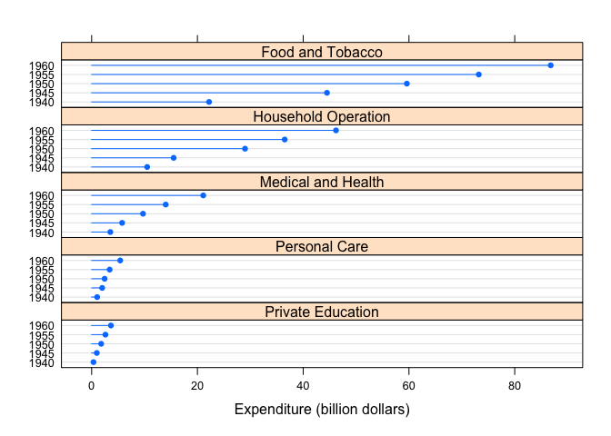<!-- -->

``` r
dp.uspe.log <-
  dotplot(
    t(USPersonalExpenditure),
    groups = FALSE,
    index.cond = function(x, y) median(x),
    layout = c(1, 5),
    scales = list(x = list(log = 2)),
    xlab = "Expenditure (billion dollars)"
  )
dp.uspe.log
```

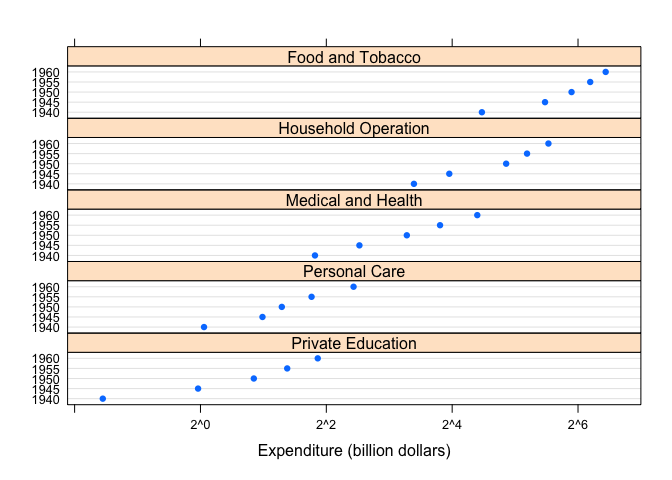<!-- -->

``` r
plot(dp.uspe, split = c(1, 1, 2, 1), more = TRUE)
plot(dp.uspe.log, split = c(2, 1, 2, 1), more = FALSE)
```

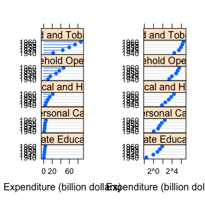<!-- -->

``` r
state <- data.frame(state.x77, state.region, state.name)
state$state.name <-
  with(state, reorder(reorder(state.name, Frost), as.numeric(state.region)))
dpfrost <-
  dotplot(
    state.name ~ Frost | reorder(state.region, Frost),
    data = state,
    layout = c(1, 4),
    scales = list(y = list(relation = "free"))
  )
dpfrost
```

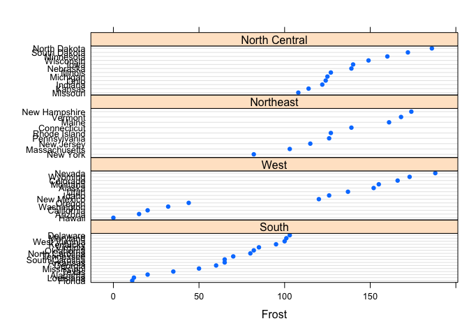<!-- -->

``` r
summary(dpfrost)
```

    ## 
    ## Call:
    ## dotplot(state.name ~ Frost | reorder(state.region, Frost), data = state, 
    ##     layout = c(1, 4), scales = list(y = list(relation = "free")))
    ## 
    ## Number of observations:
    ## reorder(state.region, Frost)
    ##         South          West     Northeast North Central 
    ##            16            13             9            12

``` r
print(
  dpfrost,
  panel.height = list(x = c(16, 13, 9, 12), unit = "null")
)
```

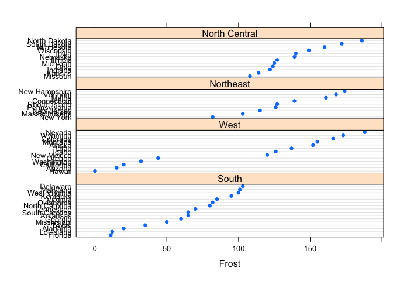<!-- -->

``` r
# library(latticeExtra)
# dpfrost
# d <- resizePanels()
```

## 11.3 The update() method and trellis.last.object()

``` r
update(trellis.last.object(), layout = c(1, 1))[2]
```

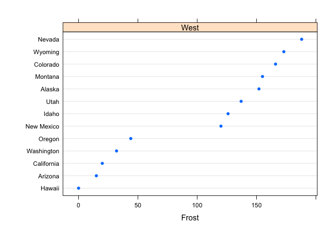<!-- -->

``` r
npanel <- 12
rot <- list(
  z = seq(0, 30, length = npanel),
  x = seq(0, -80, length = npanel)
)
quakeLocs <-
  cloud(depth ~ long + lat, quakes,
    pch = ".", cex = 1.5,
    panel = function(..., screen) {
      pn <- panel.number()
      panel.cloud(..., screen = list(
        z = rot$z[pn],
        x = rot$x[pn]
      ))
    },
    xlab = NULL, ylab = NULL, zlab = NULL,
    scales = list(draw = FALSE), zlim = c(690, 30),
    par.settings = list(axis.line = list(col = "transparent"))
  )
quakeLocs[rep(1, npanel)]
```

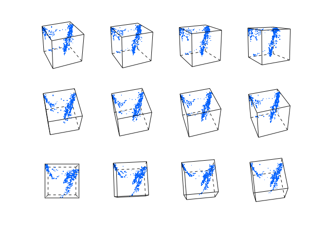<!-- -->

## 11.4 Tukey mean–difference plot

``` r
data(Chem97, package = "mlmRev")
ChemQQ <-
  qq(
    gender ~ gcsescore | factor(score),
    data = Chem97,
    f.value = ppoints(100),
    strip = strip.custom(style = 5)
  )
tmd(ChemQQ)
```

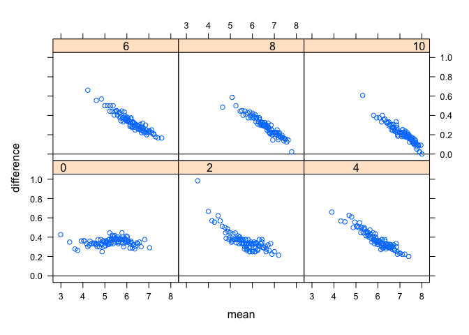<!-- -->

## 11.5 Specialized manipulations

``` r
library(latticeExtra)
head(biocAccess)
```

    ## Warning in as.POSIXlt.POSIXct(x, tz): unknown timezone 'PDT'

    ##    counts day month year hour weekday                time
    ## 21    390   1   Jan 2007    0  Monday 2007-01-01 00:00:00
    ## 22    768   1   Jan 2007    1  Monday 2007-01-01 01:00:00
    ## 23    528   1   Jan 2007    2  Monday 2007-01-01 02:00:00
    ## 24    547   1   Jan 2007    3  Monday 2007-01-01 03:00:00
    ## 25    545   1   Jan 2007    4  Monday 2007-01-01 04:00:00
    ## 26    460   1   Jan 2007    5  Monday 2007-01-01 05:00:00

``` r
baxy <-
  xyplot(
    log10(counts) ~ hour | month + weekday,
    data = biocAccess,
    type = c("p", "a"),
    as.table = TRUE,
    pch = ".",
    cex = 2,
    col.line = "black"
  )
baxy
```

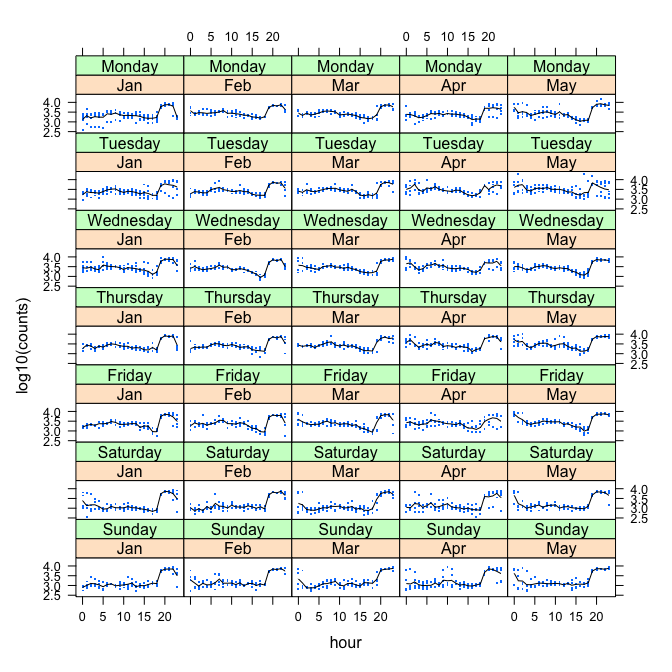<!-- -->

``` r
dimnames(baxy)$month
```

    ## [1] "Jan" "Feb" "Mar" "Apr" "May"

``` r
dimnames(baxy)$month <- month.name[1:5]
dimnames(baxy)
```

    ## $month
    ## [1] "January"  "February" "March"    "April"    "May"     
    ## 
    ## $weekday
    ## [1] "Monday"    "Tuesday"   "Wednesday" "Thursday"  "Friday"    "Saturday" 
    ## [7] "Sunday"

``` r
baxy
```

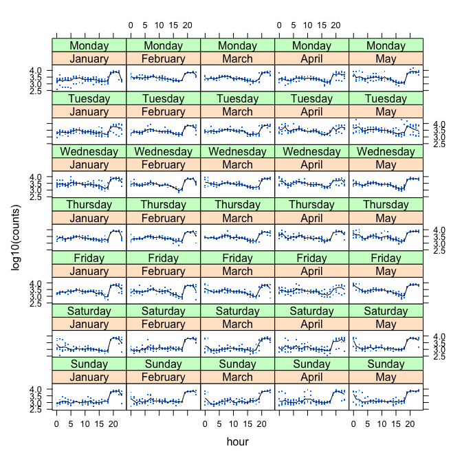<!-- -->

``` r
useOuterStrips(baxy)
```

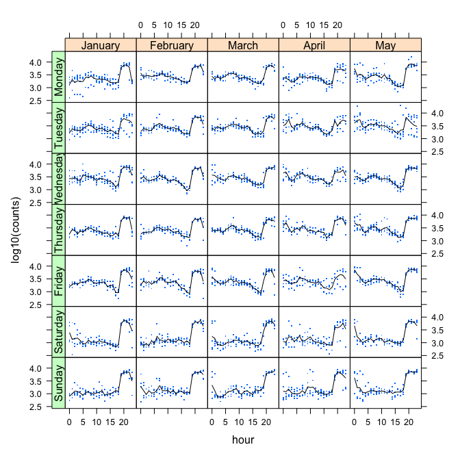<!-- -->
